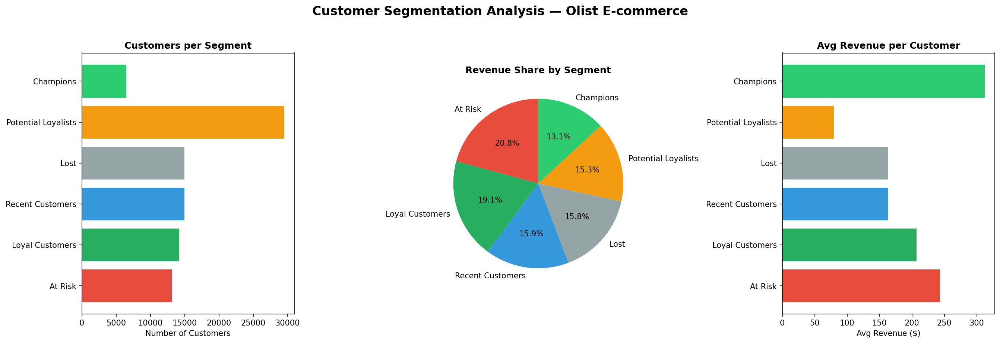
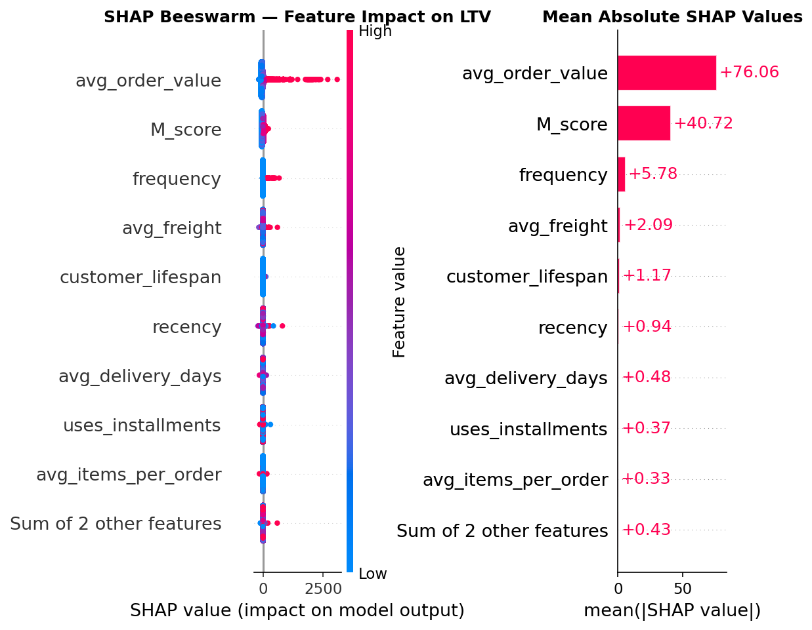
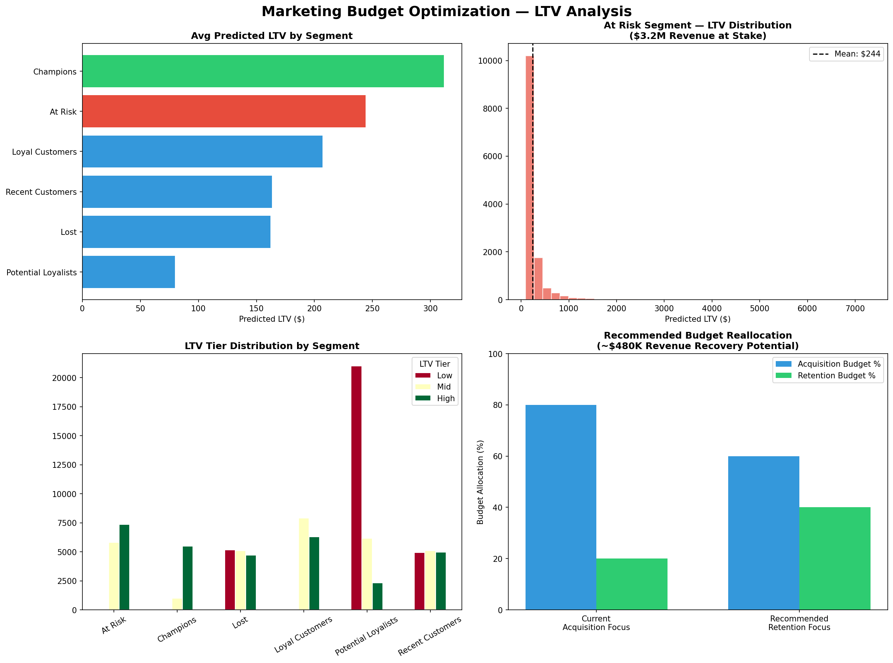

# Marketing Budget Optimization — Customer LTV Analysis
> Identifying $480K revenue recovery opportunity through ML-driven customer segmentation

## Business Problem
Olist, a Brazilian e-commerce platform, was heavily focused on customer acquisition while ignoring retention. This project analyzes 96,469 orders to identify at-risk revenue and recommend budget reallocation.

## Key Findings
- **Only 3%** of customers ever repurchased — critical retention problem
- **At Risk segment** holds $3.2M (20.8% of total revenue) at stake
- **avg_order_value** is the #1 LTV driver (SHAP value: 76.06)
- **Champions** spend 2x more than average ($311 vs $160)
- Shifting 20% of acquisition budget to retention could recover **~$480K**

## Methodology
Raw Data → SQL Cleaning → RFM Segmentation → XGBoost LTV Model → SHAP Analysis → Dashboard

## Results
| Metric | Value |
|--------|-------|
| Dataset | 93,349 customers / $15.4M revenue |
| Model | XGBoost LTV Predictor |
| R² Score | 0.824 |
| MAE | $5.55 |

## Tech Stack
- **Python**: Pandas, XGBoost, SHAP, Scikit-learn
- **Visualization**: Matplotlib, Seaborn, Power BI
- **Data**: [Olist Brazilian E-commerce](https://www.kaggle.com/datasets/olistbr/brazilian-ecommerce)

## Project Structure
- notebooks/01_EDA.ipynb — Data cleaning and exploration
- notebooks/02_ltv_model.ipynb — RFM + XGBoost + SHAP
- outputs/segment_overview.png
- outputs/shap_analysis.png
- outputs/ltv_dashboard.png
- data/rfm_tableau.csv

## Business Recommendations
1. **Shift 20% acquisition budget → retention** — target At Risk segment ($480K recovery)
2. **Upsell Potential Loyalists** (29,520 customers) — moving 10% to Champions = +$230K
3. **Personalize by avg_order_value** — highest LTV predictor per SHAP analysis

## Dashboard Preview

